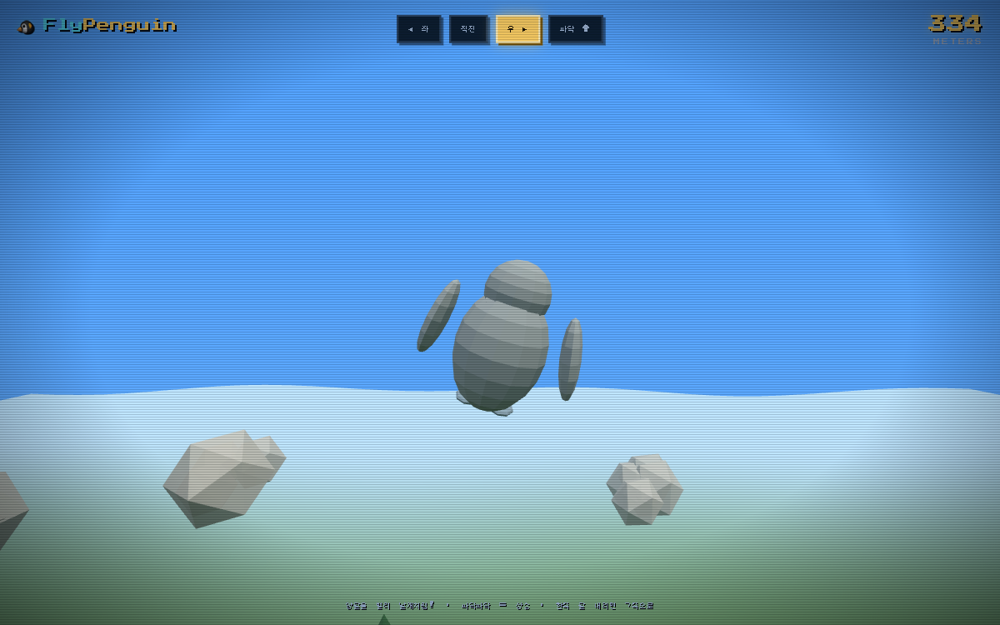
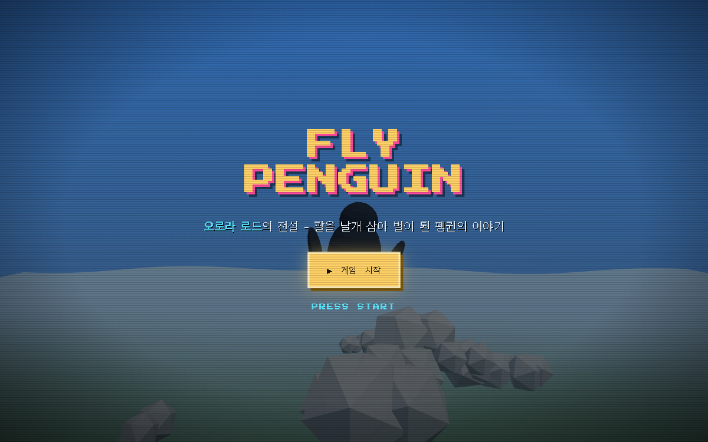
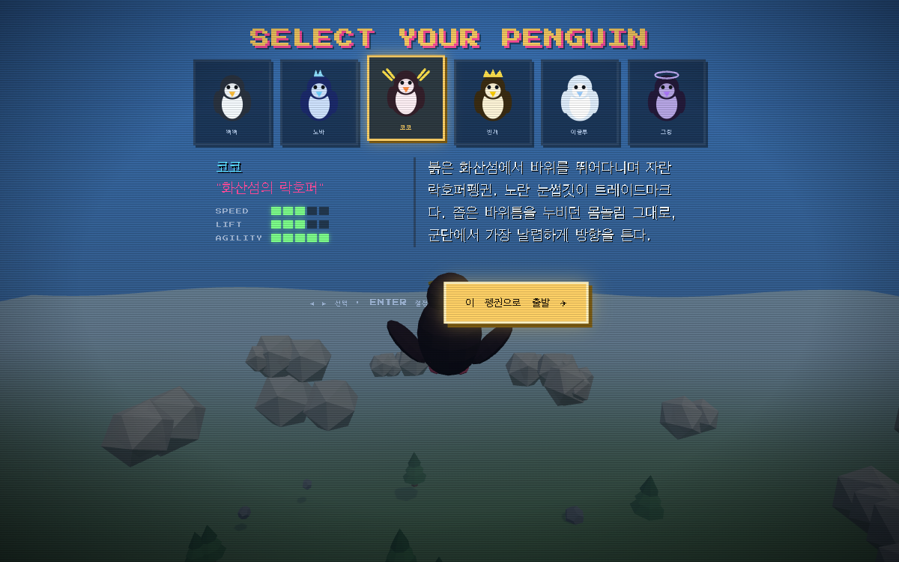

# FlyPenguin 🐧

> 📚 본 프로젝트는 패스트캠퍼스(FastCampus) 강의 자료입니다.

**웹캠 앞에서 팔을 날개처럼 펴고 펭귄을 조종하는 레트로 로우폴리 3D 비행 게임.**
키보드도 마우스도 없습니다 — 오직 몸으로 납니다.

🎮 **플레이:** https://gojaehyeon.github.io/flypenguin/



---

## 🌌 이야기

> 먼 옛날, 남극의 밤하늘엔 '오로라 로드'라 불리는 빛의 길이 있었다.
> 그 길 끝까지 날아오른 펭귄만이 별이 될 수 있다고 전해진다.
> 빙하가 녹고 무리가 흩어진 지금, 다시 하늘을 꿈꾸는 펭귄들이 모였다.
> **너의 날갯짓이, 곧 그들의 날개가 된다.**

---

## 🎛 기획: 입력 → 반응 → 형태

| 단계 | 내용 |
|---|---|
| **입력 (Input)** | 웹캠이 **MediaPipe Pose**로 어깨·팔꿈치·손목을 실시간 추적 |
| **반응 (Reaction)** | 팔 제스처를 비행 조작으로 매핑 (조향 · 상승 · 하강) |
| **형태 (Form)** | **three.js** 로우폴리 하늘을 펭귄이 날고, 나무·돌·구름이 끝없이 흐름 |

## 🕹 조작법

| 동작 | 결과 |
|---|---|
| 🙆 양팔 수평으로 벌리기 | 직진 비행 |
| 🫱 오른팔 내리기 | 오른쪽으로 선회 |
| 🫲 왼팔 내리기 | 왼쪽으로 선회 |
| 🐤 맹렬하게 파닥파닥 | 상승 (멈추면 중력으로 하강) |

> 좌우 손목 높이차로 조향하고, 손목의 상하 진동 에너지로 상승력을 계산합니다.
> 살짝 움직이는 정도로는 뜨지 않고, 계속 격렬하게 날갯짓해야 고도를 유지합니다.

## 🐧 캐릭터

게임 시작 → 프롤로그 → **캐릭터 셀렉트**. 6마리 펭귄은 색·볏 모양·스토리가 모두 다르며,
스탯(SPEED / LIFT / AGILITY)이 **실제 비행 물리에 반영**됩니다.

| 펭귄 | 별칭 | 외형 | 스탯 (속/양/민) |
|---|---|---|---|
| **삐삐** | 막내의 첫 비행 | 클래식 검정+노랑, 균형형 | 3 / 3 / 3 |
| **노바** | 자정의 항해자 | 푸른 몸 + 가시볏, 최고속 | 5 / 2 / 4 |
| **코코** | 화산섬의 락호퍼 | 핑크 + 노란 눈썹깃, 최고 민첩 | 3 / 3 / 5 |
| **번개** | 폭풍 속에서 태어난 | 금색 + 왕관, 강력 상승 | 4 / 5 / 2 |
| **이글루** | 빙하의 수호자 | 새하얀 대형, 안정형 (초보용) | 2 / 4 / 2 |
| **그림** | 밤에만 나타나는 | 보라 + 후광, 올라운더 | 4 / 4 / 4 |

## 📸 스크린샷

| 타이틀 | 캐릭터 셀렉트 |
|---|---|
|  |  |

---

## ▶️ 실행

웹캠(`getUserMedia`)은 보안 컨텍스트에서만 동작하므로 로컬 서버로 띄웁니다.

```bash
python3 -m http.server 8731
# 랜딩:  http://localhost:8731/
# 게임:  http://localhost:8731/play.html
```

> 데스크톱 **크롬** 권장. 시작 시 카메라 권한을 허용해 주세요.

## 🚀 배포 (GitHub Pages)

`main` 브랜치에 푸시하면 자동 배포됩니다. 정적 파일뿐이라 별도 빌드가 없습니다.

```bash
git add -A && git commit -m "..." && git push
```

## 🧱 기술 스택

- **[MediaPipe Tasks Vision](https://ai.google.dev/edge/mediapipe)** — `pose_landmarker_lite` (웹캠 포즈 추정)
- **[three.js](https://threejs.org/)** r160 — 로우폴리 3D 렌더링 (ESM + importmap)
- **Vanilla JS / HTML / CSS** — 빌드 도구·프레임워크 없음, CDN 의존성만 사용
- 폰트: *Press Start 2P*, *VT323* · CRT 스캔라인 + 픽셀 UI로 레트로 아케이드 룩

## 📁 파일 구조

```
flypenguin/
├─ index.html      # 랜딩 페이지 (게임 소개)
├─ play.html       # 게임 본편 (웹캠 + 3D)
├─ assets/         # 스크린샷
└─ README.md
```
